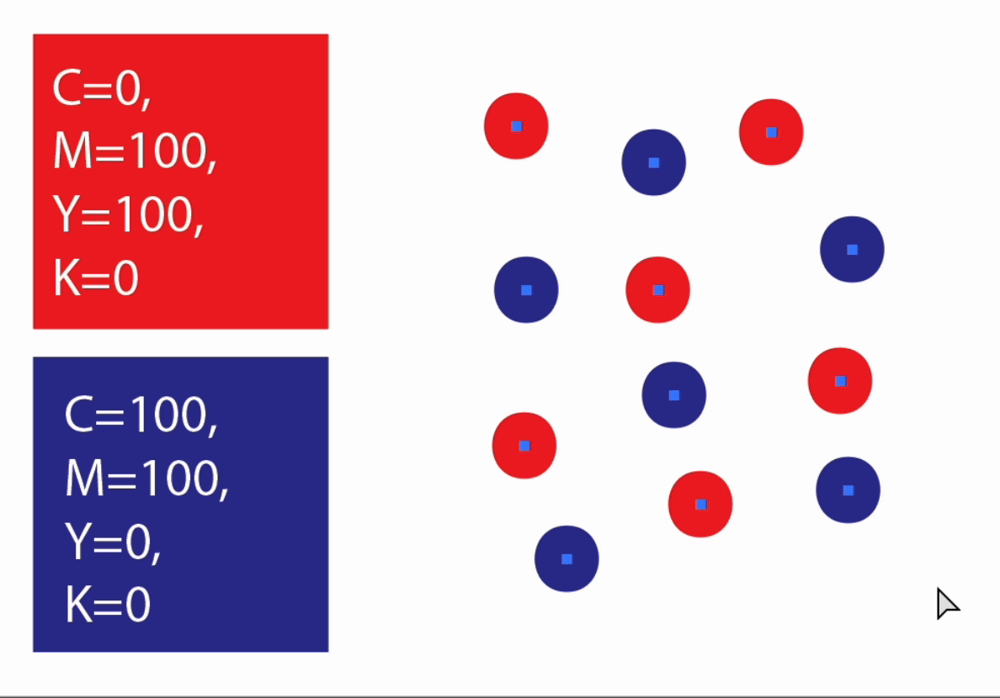

# 🎨 Colored Dots to Frames  
## ⛰️ Context  
In Coloring Book Industry it is common to spend time mapping a series of white spots to text frames with numbers. This script does not recognize white spots, but it _does_ help with color mapping to numbered text frames.  

[]

## ⚙️ How to use
This script has been tested with Illustrator v.28.7.1  
Some of the paths might be different for other versions of Illustrator.

1. Download `coloredDotsToFrames.js` and store in a known location.  
2. You will probably want to define your own color mapping. Do so by opening `coloredDotsToFrames.js` with your favourite text editor or IDE and changing `colorMap` array with your own values. Keep in mind this script works for CMYK values.  
3. Back in Illustrator, draw some shapes with a stroke color that matches the values you defined in the script.    
4. Select all shapes and use script. In MacOS shortcut is `cmd + f12` or `File > Scripts > Other Scripts > [path to file]`.  

## ⚠️ Considerations  
- The script checks for CMYK values, if you are using RGB or Spotcolor, you should change values in `colorMap` and perform a different comparison in `isMatchingColor`.  
- The script assigns font size 12, you can change this in line 65 (`textFrame.textRange.size = 12;`).  

## 👾 Contributions  
This script has been developed with assistance from GPT-4o .  